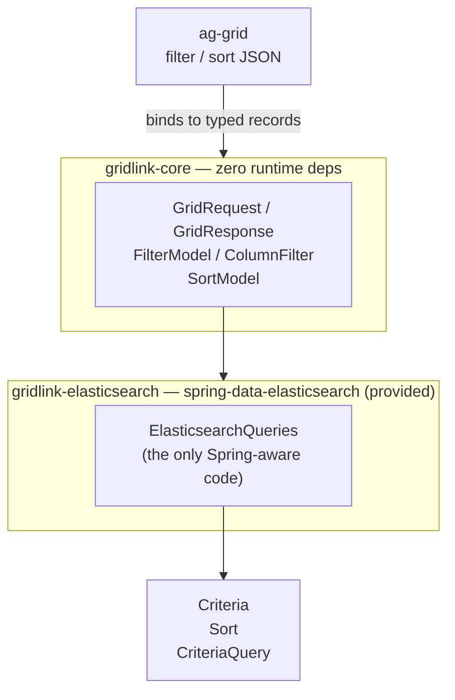
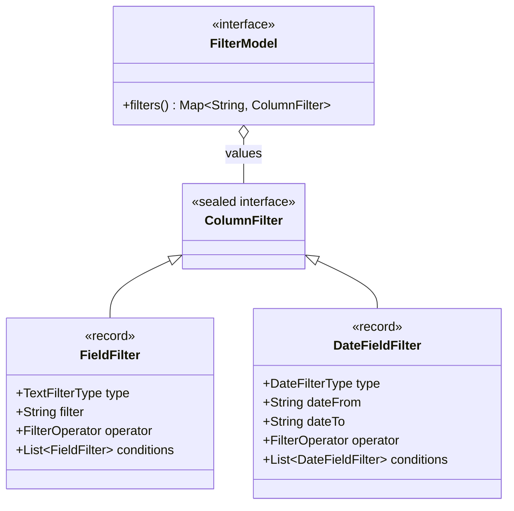

# Architecture

GridLink is ports-and-adapters. `gridlink-core` is a pure model of ag-grid's contract with no framework
ties; each adapter maps that model onto one query technology.

## Modules

| Module | Java | Runtime dependencies | Role |
| --- | --- | --- | --- |
| `gridlink-core` | 17 | none | The port: typed model of ag-grid's filter / sort / request-response JSON. |
| `gridlink-elasticsearch` | 17 | `spring-data-elasticsearch` (`provided`) | The adapter: model &rarr; `Criteria` / `Sort` / `CriteriaQuery`. |

`jspecify` supplies nullness annotations at `provided` scope only &mdash; it is not required at runtime.

## The core model

The port is a small, sealed type hierarchy. [`FilterModel`](apidocs/io/github/codedogapp/gridlink/core/filter/FilterModel.html)
exposes its columns as a `Map<String, ColumnFilter>`, and every value is one of exactly two records &mdash;
the compiler enforces the set, so translation needs no reflection.

## Design decisions

- **The model mirrors ag-grid's wire JSON**, so a request payload binds directly into typed records with
  no DTO or mapping layer. See [Filtering](filtering.md).
- **Columns are addressed by a `Map<String, ColumnFilter>`**, so a column's name is decoupled from the
  document field it targets, and [`ColumnFilter`](apidocs/io/github/codedogapp/gridlink/core/filter/ColumnFilter.html)
  stays sealed and reflection-free.
- **Paging is derived, not stored** &mdash; `offset()` / `limit()` / `pageNumber()` compute from the raw
  `startRow` / `endRow`. See [Sorting & paging](sorting-and-paging.md).
- **Columns combine via `subCriteria`**, preserving compound `OR`/`AND` branches. See
  [Elasticsearch adapter](elasticsearch-adapter.md#grouping-preserves-branches).
- **The adapter uses only the version-stable `Criteria` subset**, so one artifact serves both Spring lines.

## Compatibility

| | Version |
| --- | --- |
| Java (libraries) | 17+ |
| spring-data-elasticsearch | 5.x &rarr; Spring Boot 3 &nbsp;·&nbsp; 6.x &rarr; Spring Boot 4 |
| Elasticsearch / OpenSearch | any cluster the chosen `spring-data-elasticsearch` line supports |

One adapter artifact is tested against every supported `spring-data-elasticsearch` line in
[CI](https://github.com/codedogapp/gridlink/blob/main/.github/workflows/ci.yml); the list lives in
[`ci/spring-data-elasticsearch-versions.json`](https://github.com/codedogapp/gridlink/blob/main/ci/spring-data-elasticsearch-versions.json).

## Example

[`examples/opensearch-aggrid-demo`](https://github.com/codedogapp/gridlink/tree/main/examples/opensearch-aggrid-demo)
wires the whole path end to end &mdash; an ag-grid UI, a Spring Boot 4 backend, and OpenSearch &mdash; against a
~1,200-row catalogue.
